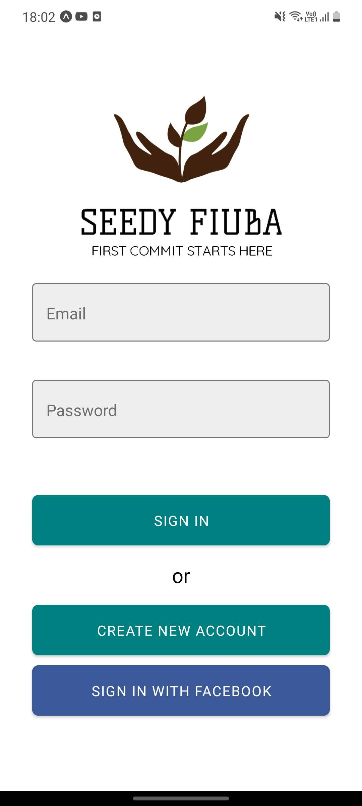
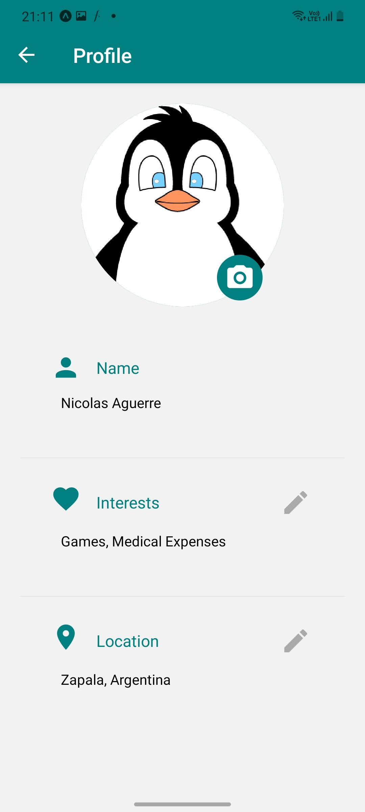
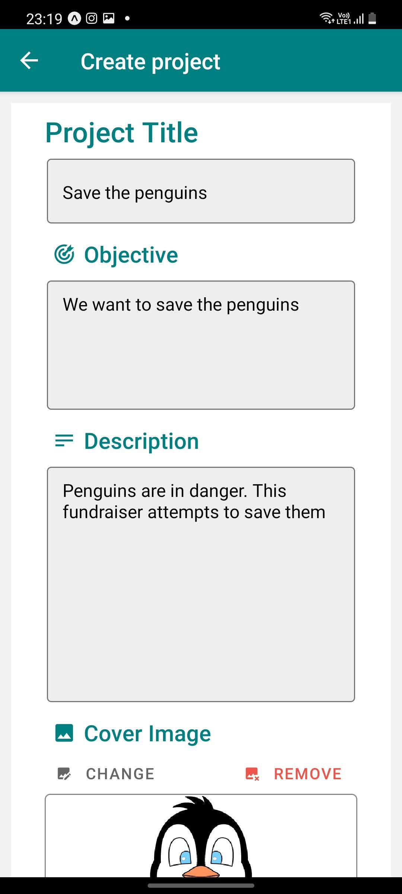
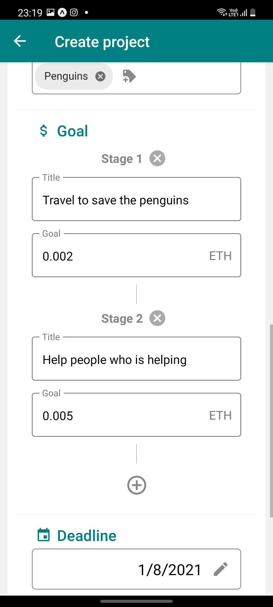
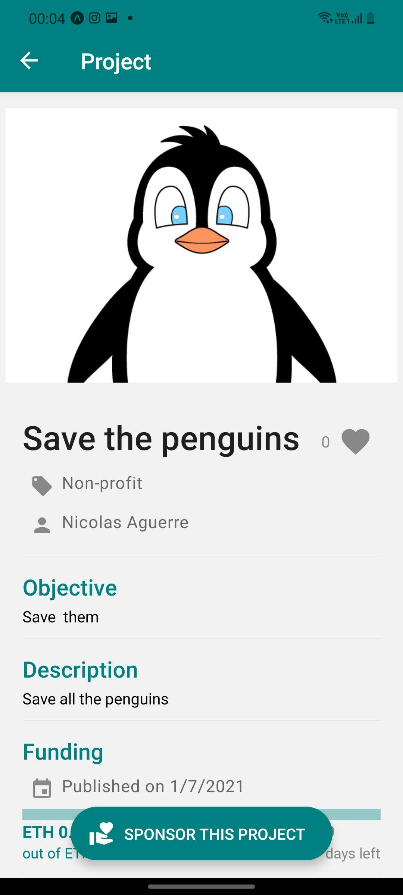
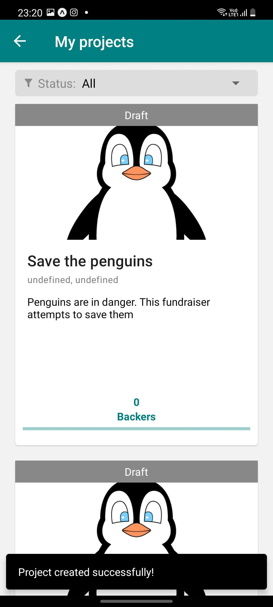
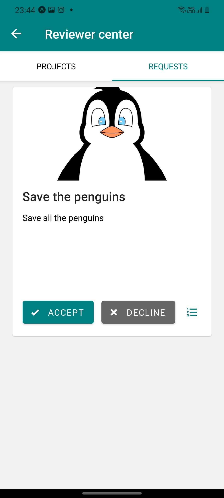
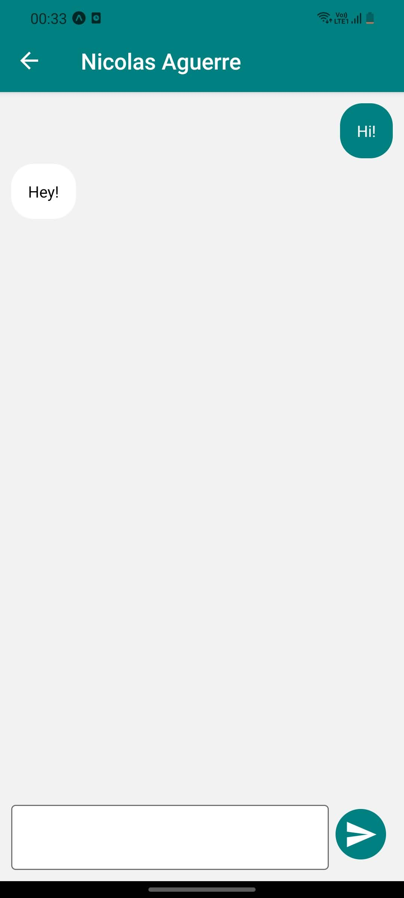
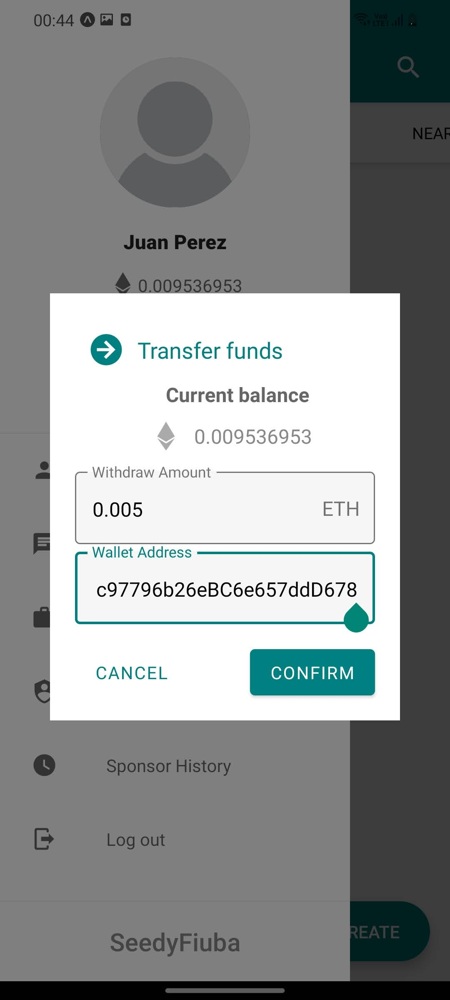

<!-- ##################################################################### -->

  

**Seedy FIUBA** is a [_crowdfunding platform_](https://en.wikipedia.org/wiki/Crowdfunding) in which you can fulfill different roles: **seek support** to fulfill your dream project, **review and moderate** the progress of other projects, as well as **fund and support** existing projects.

<!-- ##################################################################### -->

# Take a look

## Mobile application

## Backoffice web

<!--  -->

<!--  -->

<!--  -->

<!-- ##################################################################### -->
