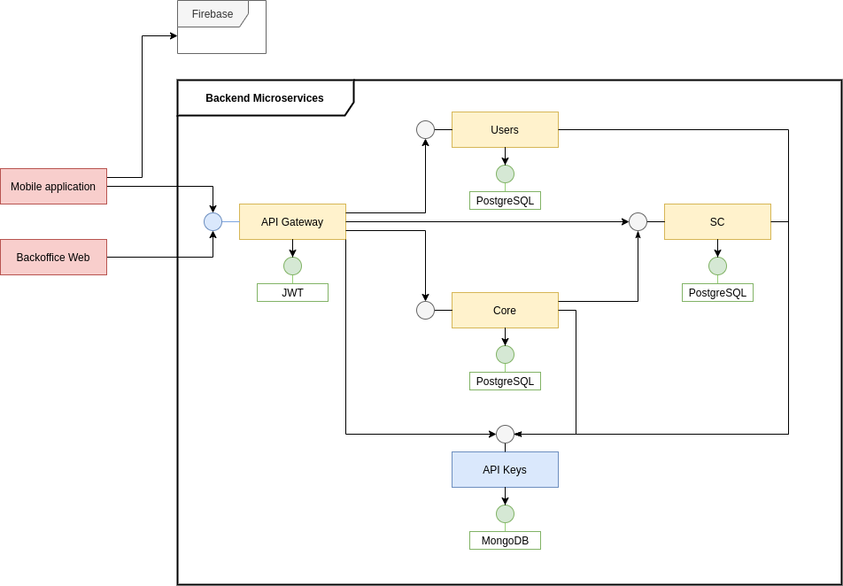

<!-- ##################################################################### -->

# Architecture

An architecture based on [**microservices**](https://microservices.io/) was used for the backend, connected among them with API Keys.

  

# REST APIs

Every backend service was designed as a REST API Microservice. Every one of them includes a `GET /api-docs` path with detailed documentation about the API that is public. Feel free to access any of them:

-   [**API Gateway**](http://sf-tdp2-gateway.herokuapp.com/api-docs/).
-   [**API Keys Microservice**](http://sf-tdp2-apikeys-main.herokuapp.com/api-docs).
-   [**Users Microservice**](https://sf-tdp2-users.herokuapp.com/api-docs/).
-   [**Core Microservice**](https://sf-tdp2-core.herokuapp.com/api-docs/).
-   [**Smart Contracts Microservice**](https://sf-tdp2-sc.herokuapp.com/api-docs/).

<!-- ##################################################################### -->
